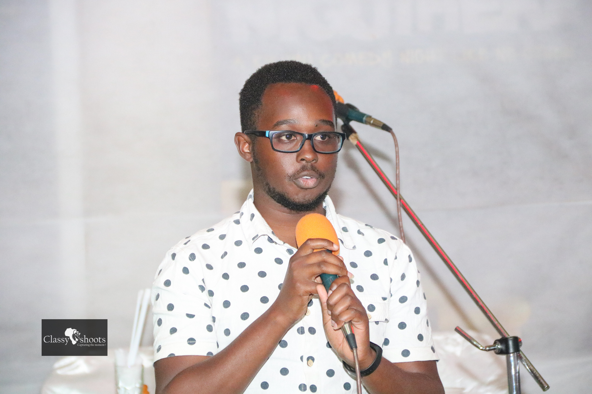

# EANBiT2020 Virtual Residential Training Participants

### 1. Caleb Kibet
Instituition: **ICIPE**

**Interests:** 
1. Genomics
1. Reproducible research
1. Open science
1. Machine learning

**Role:** Trainer / Organizer & Instructor / Mentor

**Photo of Caleb**: 

___

### 1. Evans Mudibo

Institution: **Pwani University**

Interests:
1. Viral bioinformatics
2. Molecular epidemiology

Designation: Student

Evans' Photo:

### 2. Nsangi Olga Tendo
Instituituion: **Makerere University**
Role: **Bioinformatics Student**

**Interests**
1. Machine learning
1. Genomics
1. Reproducible research

Edited by: **Olga Nsangi** 

___

### 2. Emmanuel Mande
Instituition: **Makerere University**

Interests: 
1. Genomics
2. Machine Learning/ Big Biodata
3. Infectious diseases

Role: Student

### 30. Mthande Mzwakhile 

**Interest:**
1. Soccer
2. Reading
3. Watching TV

**Role**: Participant 
**Institution:** Makerere University

**Photo Of Mthande**
![Mthande] (https://avatars3.githubusercontent.com/u/61830617?s=400&u=a3ae71db5e3c831345936c2783b0de21d2682a8b&v=4)

### 22. Mike Mwanga
Institution: **Pwani University**

Interests:
1. Football
2. Health Science
3. Memes
4. Graphics

Role: Student

Photo:

### Ritah Nabunje
Institution: Makerere University

Interests:
1. Parasite genomics
1. Human genetics
1. Genetic Association Studies

Role: Participant

Photo:

### 2. Eneza Yoeli
Instituition: **PWANI**

Interests: 
1. Molecular biology
1. Bioinformatics

Role: Student

Photo: 

### Shahiid KIyaga
Institution:***Makerere University***

Interests;  
1. ***Antimicrobial resistance(AMR)***

2. ***Vaccine development***
3. ***Phylogenetics***
4. ***Disease dynamics and modelling***
5. ***Host-pathogen genomics***
6. ***Population genetics and genomics***
           
Role: ***Participant***

photo:

### Wasswa Razack
Instituition: Makerere University

Interests:
1. Metagenomics
1. Cancer Genomics
1. Diagnostics - Molecular

Role: Participant

Photo:
https://avatars3.githubusercontent.com/u/13275154?s=96&v=4

### Emmanuel Mande
Institution: Makerere University

Interests:
1. Genomics
1. Big Data ? Machine learning
1. Infectious Diseases

Role: Participant

### Geoffrey Kimani
Instituition: **ICIPE**

**Interests:** 
1. Computer Science
2. AI
3. DS

**Role:** Technical Support

**Photo of Geoffrey**: 

### Akurut Eva
Institution: **Makerere University**

Interests:

1. Genomics
1. Bacterial genomics
1. Vaccinomics
1. Immunogenomics
1. Human genetics

Passion:
Reading and Dancing

Expectations:
1. Learn as much as possible regarding Bioinformatics and its applications especailly new ideas.
1. Can't wait to work on mini-projects with my collegues and be challanged

Role: Participant

Photo: 

### Stella Esther Nabirye

Instituion: Makerere University

Interests:
1. Viral Transmission patterns and mutation dynamics
2. Human genetics

Role: Contributor

Photo:

___

### Jane Njeri
**Institution:** Pwani University

**Interests:**
1. Statistical genomics
2. Biomarker identification
3. Machine learning
4. Reproducible research
5. Salsa

**Role:** Student

**Photo**

### Davis Kiberu 
**Institution:** Makerere University &#x1F4D8;  

**Interests:**  
Big data

**Role:** `Student`  

### Omara Isaac Emmanuel
**Institution** 
Makerere University

**Role** 
Bioinformatics(MSc) / Collaborator

**Interests**
1. Watching Documentaries
2. Current Affairs

**Likes** 
1. Bioinformatics
2. Molecular Biology

**Nationality** 
Ugandan

### Levis Katwiire

**Interests**
1. Cancer genomics
2. Genome wide Association studies
3. Parasite genomics

**Role:** Student

### Paul Talent
Instituition: **Makerere University**

Interests: 
1. Genomic data analysis
2. Machine Learning
3. Open science

Role: Trainee

### 1. Peter Muchina
Instituition: **ICIPE**

**Interests:** 
1. Genomics
1. Reproducible research
1. Open science

**Role:** Trainee

**Photo**

### Senamile Dlamini
Institution: Makerere University

Interests:
1. Computational Biology
2. Bioinformatics

**Bio**

### 13. Kester Bevin
Institution **Makerere University**

Interests:
1. Bacterial Genomics
2. AMR
3. Sports

Role: **Participant**

Photo:

Role: Trainee

### Agasi Herbert
Institution: Makerere University

Interests:
1. Genomics
2. Machine Learning

Role: Trainee

