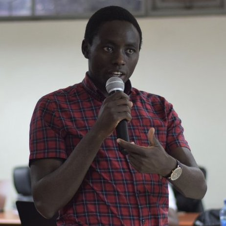

# EANBiT2020 Virtual Residential Training Participants

### 1. Caleb Kibet
Instituition: **ICIPE**

**Interests:** 
1. Genomics
1. Reproducible research
1. Open science

**Role:** Trainer / Organizer / Mentor

**Photo of Caleb**: 

**Bio**

Edited by: Kakembo Fredrick Elishama
